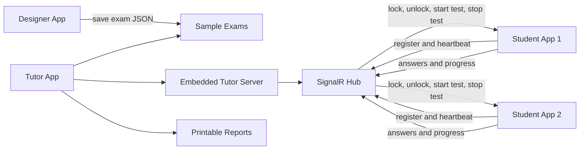

# NetSupport School Demo Team Plan

## Goal

Build a **4-hour demo MVP** that satisfies the lab form and demonstrates the required features clearly. This is not a production clone of NetSupport School. To finish in 4 hours, the app will use demo-safe versions of hard system features:

- "Starts as a service" means the Student app can be launched at startup or opened manually for the demo.
- "Lock/unlock computers" means the Student app shows a full-screen topmost lock screen and removes it when Tutor unlocks.
- "Auto detect students" means Student apps connect/register to the Tutor server and appear automatically.
- "Print report" means export a printable HTML report and optionally open the browser print dialog.

## Recommended Stack

Use **C# / .NET 8 + WinForms + SignalR + JSON files**.

- It is Windows-friendly and easy to package as zip folders.
- WinForms is faster than WPF for a 4-hour lab MVP.
- SignalR avoids writing low-level socket code for live updates.
- JSON storage is faster than SQLite for the first version and easier for AI agents to generate.

## Repository And Folder Architecture

Create this structure in the repo root:

```text
Net-support-school---Demo/
  NetSupportSchool.sln
  README.md
  .gitignore
  docs/
    TEAM_PLAN.md
    DEMO_SCRIPT.md
    SUBMISSION_FORM_DATA.md
  samples/
    exams/
      arabic-sample-exam.json
      english-sample-exam.json
  src/
    NetSupport.Shared/
      NetSupport.Shared.csproj
      Models/
        StudentInfo.cs
        Exam.cs
        Question.cs
        Choice.cs
        TestSession.cs
        StudentAnswer.cs
        StudentProgress.cs
        ReportRow.cs
      Contracts/
        TutorCommand.cs
        StudentEvent.cs
      Storage/
        JsonFileStore.cs
      Localization/
        AppLanguage.cs
    NetSupport.Tutor/
      NetSupport.Tutor.csproj
      Program.cs
      Forms/
        TutorDashboardForm.cs
        TestSetupForm.cs
        LiveTrackingForm.cs
        ReportForm.cs
      Server/
        TutorHub.cs
        TutorServer.cs
      Services/
        StudentRegistry.cs
        TestSessionManager.cs
        ReportService.cs
    NetSupport.Student/
      NetSupport.Student.csproj
      Program.cs
      Forms/
        StudentLoginForm.cs
        StudentHomeForm.cs
        LockScreenForm.cs
        TestTakingForm.cs
      Services/
        StudentClient.cs
        HeartbeatService.cs
        TestAnswerService.cs
    NetSupport.Designer/
      NetSupport.Designer.csproj
      Program.cs
      Forms/
        ExamDesignerForm.cs
        QuestionEditorForm.cs
      Services/
        ExamDesignerService.cs
  output/
    setup/
      Tutor/
      Student/
      Designer/
```

## Runtime Architecture



## Team Rules

- Every member works on their own branch, for example `feature/member-02-tutor-dashboard`.
- Every member commits using their own GitHub account.
- Every member should make at least 2 commits: one for initial implementation and one for fixes/polish.
- Keep changes small and focused on the assigned folder.
- Do not build advanced features that are not in the demo script.
- If a feature is blocked, replace it with a clear demo-safe simulation and document it in `README.md`.

## Member Tasks And AI-Agent Prompts

### Member 1 - Team Leader / Integration / QA

Branch: `feature/member-01-setup-integration`

Deliverables:

- Create solution and folder architecture.
- Create `README.md`, `docs/TEAM_PLAN.md`, `docs/DEMO_SCRIPT.md`, and `docs/SUBMISSION_FORM_DATA.md`.
- Add all projects to `NetSupportSchool.sln`.
- Merge branches, resolve conflicts, publish apps, create setup zip.
- **End-to-end verification (Member 1 owns the acceptance test):** run through the full demo path before submission — build/publish all three apps, Tutor first then Student, Designer exam JSON load/save, lock/unlock, test setup/start/stop, student timer and answers, live tracking (answered rows + correct/incorrect colors), report export to a chosen path, Arabic/RTL smoke test on main screens, and LAN settings (`connection-settings.json` / Tutor Settings) if multi-PC. Track issues, confirm fixes, and update `README.md` when behavior or packaging changes.

AI-agent prompt:

```text
Create a .NET 8 WinForms solution named NetSupportSchool with projects NetSupport.Shared, NetSupport.Tutor, NetSupport.Student, and NetSupport.Designer. Add the folder architecture from docs/TEAM_PLAN.md. Add a README with build, run, demo, and packaging steps. Keep code simple and demo-ready.
```

### Member 2 - Tutor Dashboard And Auto Detection

Branch: `feature/member-02-tutor-dashboard`

Deliverables:

- `TutorDashboardForm` showing connected students.
- Buttons for lock, unlock, setup test, start test, stop test, tracking, report.
- Auto-refresh when students register or heartbeat.

AI-agent prompt:

```text
Implement NetSupport.Tutor TutorDashboardForm. It should show connected students in a grid with name, machine name, status, answered count, score, and last seen. Add buttons for Lock, Unlock, Setup Test, Start Test, Stop Test, Live Tracking, and Report. Use StudentRegistry and shared models. Keep the UI simple WinForms.
```

### Member 3 - SignalR Hub And Shared Contracts

Branch: `feature/member-03-communication`

Deliverables:

- `TutorHub`, `TutorServer`, `TutorCommand`, `StudentEvent`.
- Methods for student registration, heartbeat, progress update, answer submission.
- Commands from Tutor to selected students.

AI-agent prompt:

```text
Implement a simple SignalR communication layer for NetSupport.Tutor and NetSupport.Student. Tutor hosts an embedded SignalR hub. Students connect, register, send heartbeat, send progress, and receive commands: Lock, Unlock, StartTest, StopTest. Use shared contract classes in NetSupport.Shared.
```

### Member 4 - Student Registration And Heartbeat

Branch: `feature/member-04-student-registration`

Deliverables:

- `StudentLoginForm` for student name/id (hub URL is configured via Tutor **Settings** / shared `connection-settings.json`, not typed by the student).
- `StudentClient` connects to Tutor hub.
- Heartbeat every few seconds.
- Reconnect message if disconnected.

AI-agent prompt:

```text
Implement NetSupport.Student registration and heartbeat. Add StudentLoginForm to collect student full name and student id. After login, connect to SignalR TutorHub using StudentClient (hub URL from shared settings) and send heartbeat every few seconds. Show connection status in StudentHomeForm.
```

### Member 5 - Student Lock And Unlock

Branch: `feature/member-05-lock-unlock`

Deliverables:

- `LockScreenForm` as full-screen topmost demo lock.
- Student receives Lock/Unlock commands.
- Lock screen supports Arabic and English text.

AI-agent prompt:

```text
Implement demo lock/unlock in NetSupport.Student. When StudentClient receives Lock, show a full-screen topmost LockScreenForm with a message that the computer is locked by the tutor. When Unlock is received, close the lock form. Do not use destructive Windows APIs; this is a safe demo simulation.
```

### Member 6 - Designer MCQ Exam Creation

Branch: `feature/member-06-designer`

Deliverables:

- `ExamDesignerForm` for exam title, time limit, questions, choices, correct answer.
- Save and load exam JSON files in `samples/exams`.
- Validation: every question has choices and one correct answer.

AI-agent prompt:

```text
Implement NetSupport.Designer MCQ exam creation. Add forms to create an exam with title, duration, questions, four choices, and one correct answer. Save and load JSON exam files using shared Exam, Question, and Choice models. Add validation and Arabic-friendly text fields.
```

### Member 7 - Tutor Test Setup And Start/Stop

Branch: `feature/member-07-test-flow`

Deliverables:

- `TestSetupForm` for selecting students, exam, and time.
- `TestSessionManager` creates active session.
- Start/Stop sends commands to selected students.

AI-agent prompt:

```text
Implement Tutor test setup. Add TestSetupForm where tutor chooses connected students, selects an exam JSON file, sets duration, then starts the test. Send StartTest command with exam data and duration to selected students. Add StopTest command that ends the active test for selected students.
```

### Member 8 - Student Test Login And Navigation

Branch: `feature/member-08-student-test`

Deliverables:

- Student receives `StartTest`.
- `TestTakingForm` displays MCQ questions, navigation (including clickable question list), timer, answer selection, progress to tutor, submit.
- Auto-submit on `StopTest`.

AI-agent prompt:

```text
Implement Student test taking. When StartTest command arrives, open TestTakingForm. Display exam questions with MCQ options, navigation, timer, answered count, and Submit. Send progress (including answer snapshots for live tracking) and final answers to Tutor. StopTest should submit current answers and close the test.
```

### Member 9 - Live Tracking And Reports

Branch: `feature/member-09-tracking-reports`

Deliverables:

- `LiveTrackingForm` shows student status, answered count, remaining time; detail grid lists **answered** questions with **Correct/Incorrect** (row colors).
- `ReportService` calculates score as correct/total.
- `ReportForm` exports printable HTML report (save path chosen by user) with student names, scores, answered count.

AI-agent prompt:

```text
Implement live tracking and reports in NetSupport.Tutor. Track each selected student's progress during a test: status, answered questions, remaining time, and submitted state. After stop/submit, calculate score using correct answers. Generate a printable HTML report with student name, score, answered questions, and total questions.
```

### Member 10 - Arabic Support, UI Polish, Demo Script

Branch: `feature/member-10-arabic-docs`

Deliverables:

- Arabic labels for main screens.
- RTL layout option or Arabic mode.
- Arabic sample exam.
- Demo script and future features list.

AI-agent prompt:

```text
Add Arabic support and final polish. Add an Arabic/English language toggle or Arabic labels on the main forms. Set RightToLeft and RightToLeftLayout where appropriate. Create an Arabic sample MCQ exam JSON. Write docs/DEMO_SCRIPT.md showing exactly how to demo Tutor, Student, Designer, lock/unlock, test flow, tracking, report, and each member contribution.
```

## Shared Models To Agree On Early

These models should be created first so all members can work without conflicts:

```csharp
public sealed class StudentInfo
{
    public string StudentId { get; set; } = "";
    public string FullName { get; set; } = "";
    public string MachineName { get; set; } = "";
    public string Status { get; set; } = "Connected";
    public DateTime LastSeenUtc { get; set; }
}

public sealed class Exam
{
    public string Id { get; set; } = Guid.NewGuid().ToString("N");
    public string Title { get; set; } = "";
    public int DurationMinutes { get; set; } = 10;
    public List<Question> Questions { get; set; } = new();
}
```

## Minimum Demo Acceptance Checklist

- Tutor opens; embedded server starts when the dashboard loads (or verify Settings / port if changed).
- Two Student app windows connect and appear in Tutor automatically.
- Tutor can lock and unlock a Student window.
- Designer creates or loads an MCQ exam.
- Tutor selects students, selects exam, sets time, and starts test.
- Student logs in, navigates MCQs, answers, and submits.
- Tutor sees live answered count/status.
- Tutor stops test.
- Tutor opens printable report with student names, scores, and answered questions.
- Arabic text appears in at least main screens and sample exam.
- Repo shows commits from all 10 GitHub usernames.
- Setup zip contains Tutor, Student, Designer, samples, and README.

## Submission Form Preparation

Collect this in `docs/SUBMISSION_FORM_DATA.md`:

- Team Leader Full Name in Arabic.
- Team Leader Email Address.
- Names of Other 9 Team Members: full Arabic name + GitHub username used in commits, one per line.
- GitHub Repository Link: `https://github.com/mohamed-295/Net-support-school---Demo.git` unless the team changes it.
- Video file under 100 MB and max 5 minutes.
- Setup zip under 100 MB.
- Future-year feature suggestions: real Windows service installer, real remote screen view, file distribution, chat, attendance analytics, browser lockdown, question bank import/export, role-based accounts, cloud classroom mode.
- Lab rating from 1 to 5.

## Git Workflow

- Main branch: `main`.
- Work branches: `feature/member-XX-topic`.
- Merge order: shared models first, communication second, UI features third, polish/docs last.
- Commit message format: `member-XX: short description`.
- Each member should avoid editing files outside their assigned area unless coordinating with Team Leader.

## What To Avoid In 4 Hours

- Do not build a real Windows service installer unless everything else is finished.
- Do not use real OS-level locking APIs.
- Do not add authentication accounts beyond student test login.
- Do not add a database unless JSON storage becomes a blocker.
- Do not spend time on advanced UI styling before the workflow works.
